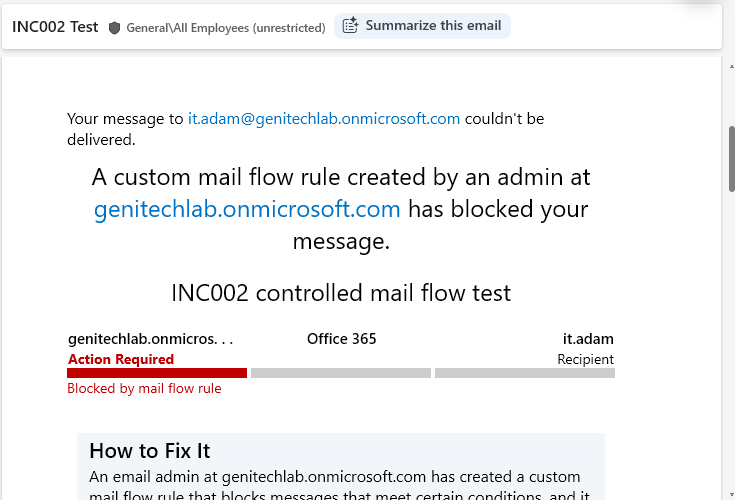
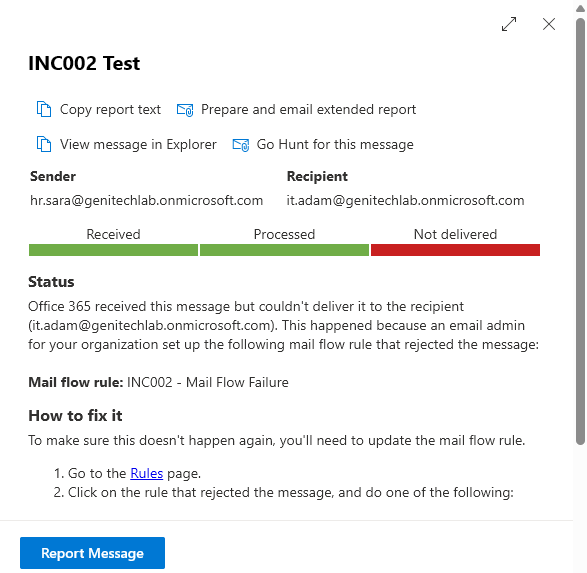
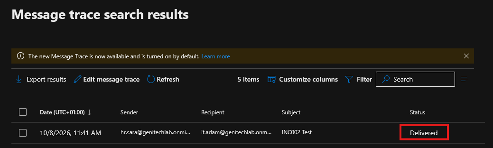

# INC002 — Exchange Online Mail Flow Failure

## Incident Overview

A controlled mail flow failure was simulated in Exchange Online to investigate an email delivery issue.

The test demonstrated the complete troubleshooting lifecycle:

```text
Fault Injection
      ↓
Investigation
      ↓
Root Cause Identification
      ↓
Remediation
      ↓
Validation
```

```
This was a controlled lab simulation, not a production incident.
```

## Environment
Microsoft 365 / Exchange Online
Exchange Admin Center (EAC)
Outlook
Microsoft Entra ID
ServiceNow ITSM lab

## Scenario

A test email was sent from:
```
hr.sara@genitechlab.onmicrosoft.com
```
to:

```
it.adam@genitechlab.onmicrosoft.com
```
The message was intentionally blocked using an Exchange Online Mail Flow Rule.

## 1. Fault Injection

A Mail Flow Rule was created in:

Exchange Admin Center → Mail flow → Rules

## Rule
```
INC002 - Mail Flow Failure
```
The rule was configured to reject the test message and return the explanation:
```
INC002 controlled mail flow test
```
After enabling the rule, the test email generated an NDR indicating that the message had been blocked by a mail flow rule.

## The NDR confirmed:



Recipient: it.adam@genitechlab.onmicrosoft.com
Message was not delivered
A custom mail flow rule blocked the message
The configured explanation was displayed:
INC002 controlled mail flow test

This confirmed that the controlled fault had been successfully injected.

## 2. Investigation

The next step was to investigate the delivery failure using Exchange Online Message Trace.

The message was searched using:

| Field     | Value                                 |
| --------- | ------------------------------------- |
| Sender    | `hr.sara@genitechlab.onmicrosoft.com` |
| Recipient | `it.adam@genitechlab.onmicrosoft.com` |

The Message Trace result showed that Exchange Online received the message but did not deliver it.

## Message Trace Evidence



The detailed Message Trace result confirmed:

| Field          | Result                                |
| -------------- | ------------------------------------- |
| Sender         | `hr.sara@genitechlab.onmicrosoft.com` |
| Recipient      | `it.adam@genitechlab.onmicrosoft.com` |
| Status         | `Not delivered`                       |
| Mail Flow Rule | `INC002 - Mail Flow Failure`          |

The trace explicitly identified the Mail Flow Rule responsible for rejecting the message.

## 3. Root Cause

The root cause was identified as the Exchange Online Mail Flow Rule:

```INC002 - Mail Flow Failure```

```
The rule matched the test message and rejected it before delivery to the recipient.
```

## Root Cause
```
Exchange Online
      ↓
Mail Flow Rule matched
      ↓
Message rejected
      ↓
Recipient did not receive the email
```
## 4. Remediation

The identified Mail Flow Rule was disabled in:

Exchange Admin Center → Mail flow → Rules

The rule was disabled rather than deleted so that the controlled test configuration remained available for future testing and documentation.

## 5. Validation

After disabling the Mail Flow Rule, the same email flow was tested again.

The message was successfully delivered to:

it.adam@genitechlab.onmicrosoft.com

## Successful Delivery Evidence

The successful delivery confirmed that disabling the Mail Flow Rule restored normal email delivery.

## 6. Resolution

The simulated email delivery incident was resolved by:



Identifying the Exchange Online Mail Flow Rule responsible for the rejection.
Confirming the rejection through Message Trace.
Disabling the faulty Mail Flow Rule.
Re-testing the same email flow.
Confirming successful message delivery.

## Final Workflow
```
Test Email
    ↓
Exchange Online
    ↓
Mail Flow Rule matched
    ↓
Message rejected
    ↓
NDR generated
    ↓
Message Trace investigation
    ↓
Root Cause identified
    ↓
Mail Flow Rule disabled
    ↓
Email sent again
    ↓
Successful delivery
```

## Skills Demonstrated
Exchange Online administration
Exchange Admin Center
Mail Flow Rules
Message Trace
Email delivery troubleshooting
Root cause analysis
Controlled fault injection
Incident investigation
Remediation and validation
Technical documentation

## Incident Outcome

- Status: Resolved

- Root Cause: Exchange Online Mail Flow Rule rejected the message.

- Remediation: Mail Flow Rule disabled.

- Validation: Successful email delivery confirmed.

- Result: End-to-end Exchange Online mail flow troubleshooting successfully completed.
